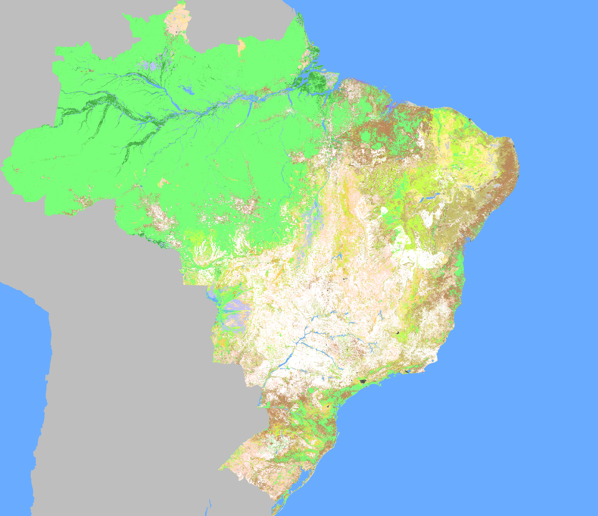

## SimNation - Dados

### Países

https://www.naturalearthdata.com/http//www.naturalearthdata.com/download/10m/cultural/ne_10m_admin_0_map_units.zip

### Relevo

http://srtm.csi.cgiar.org/srtmdata/ (Tile 30 x 30 degree)

Para o Brasil, salvei os tiles
- S30W060
- S30W090
- N00W090
- N00W060

Para unir os 4 tiles, rodei no R:

```
```

### Cobertura vegetal

#### GLC2000 (Global Land Cover 2000 Project)

- Resolução de 1 km
- 22 classes

https://forobs.jrc.ec.europa.eu/products/glc2000/glc2000.php

Para cortar apenas o Brasil, com cores pre-definidas, rodei no R:

```
library(rgdal)
library(raster)
# 1	Tree cover, broadleaved, evergreen 79ff79
# 2	Tree cover, broadleaved. deciduous closed caff4c
# 3	Tree cover, broadleaved, deciduous, open caff4c
# 4	Tree cover needle-leaved, evergreen 6bc3c8
# 5	Tree cover needleleaved, deciduous 6bc3c8
# 6	Tree cover, mixed leaf type 6bc3c8
cores <- c('#79ff79','#caff4c','#caff4c','#6bc3c8','#6bc3c8','#6bc3c8',
# 7	Tree cover, regularly flooded, fresh water 46ac46
# 8	Tree cover, regularly flooded saline water ba69c0
# 9	Mosaic: Tree Cover / Other natural vegetation c3834a
# 10	Tree Cover, burnt ff0000
# 11	Shrub Cover, closed-open, evergreen ffc549
# 12	Shrub Cover, closed-open, deciduous ffc549
           '#46ac46','#ba69c0','#c3834a','#ff0000','#ffc549','#ffc549',
# 13	Herbaceous Cover, closed-open ffddce
# 14	Sparse herbaceous or sparse shrub cover fff9a5
# 15	Regularly flooded shrub and/or herbaceous cover c1c1ff
# 16	Cultivated and managed areas ffffff
# 17	Mosaic: Cropland / Tree Cover / Other natural vegetation ba875a
# 18	Mosaic: Cropland / Shrub and/or grass cover c4ba69
           '#ffddce','#fff9a5','#c1c1ff','#ffffff','#ba875a','#c4ba69',
# 19	Bare Areas d2d2d2
# 20	Water Bodies 69acff
# 21	Snow and Ice d2d2d2
# 22	Artificial surfaces and associated areas 505050
# 23  NA
           '#d2d2d2','#69acff','#d2d2d2','#505050','#000000')
w <- readOGR('~/Videos/shp/shp/ne_10m_admin_0_map_units','ne_10m_admin_0_map_units',stringsAsFactors=F)
r <- raster('~/R/GLC2000/glc2000_v1_1')
(i <- grep('BRA',w$ISO_A3))
sigla <- w$ISO_A3[i]
print(paste0(i,'/',nrow(w),' - ',w$NAME_PT[i],' (',sigla,')'))
ext <- extent(w[i,])
rp <- crop(r,ext)
rP <- mask(rp,w[i,])
png(paste0('paises/',sigla,'.png'),dim(rP)[2],dim(rP)[1])
par(mar=c(0,0,0,0),xaxs='i',yaxs='i',bg=cores[20]) # bg água
plot(w[i,],border=NA,asp=1)
plot(w,add=T,col='gray',border=NA) # continente cinza
plot(rP,col=cores,add=T,legend=F,maxpixels=dim(rP)[1]*dim(rP)[2],zlim=c(1,23))
dev.off()

```



#### CCI Land Cover V2 (Climate Change Initiative)

- Resolução de 300 m
- 23 (37?) classes
- Imagens anuais de 1992 a 2015

http://maps.elie.ucl.ac.be/CCI/viewer/download.php

Para cortar apenas o Brasil, com as [cores padrão](http://maps.elie.ucl.ac.be/CCI/viewer/download/ESACCI-LC-Legend.csv), rodei no R:

```

```
