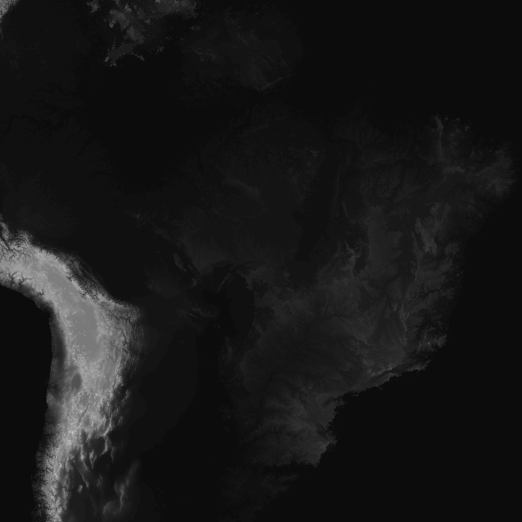
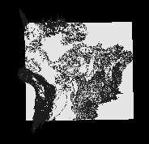
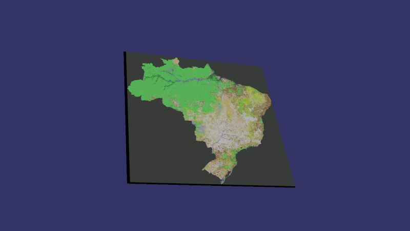
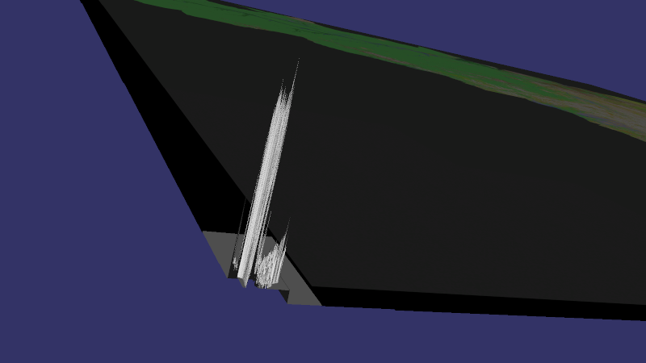
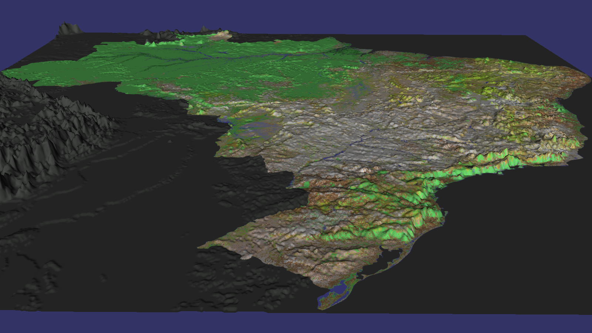
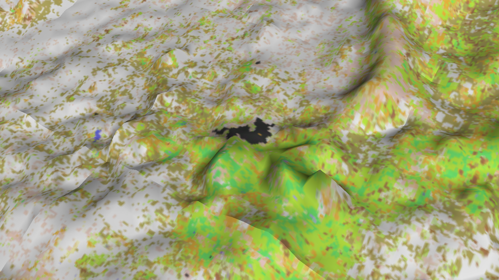
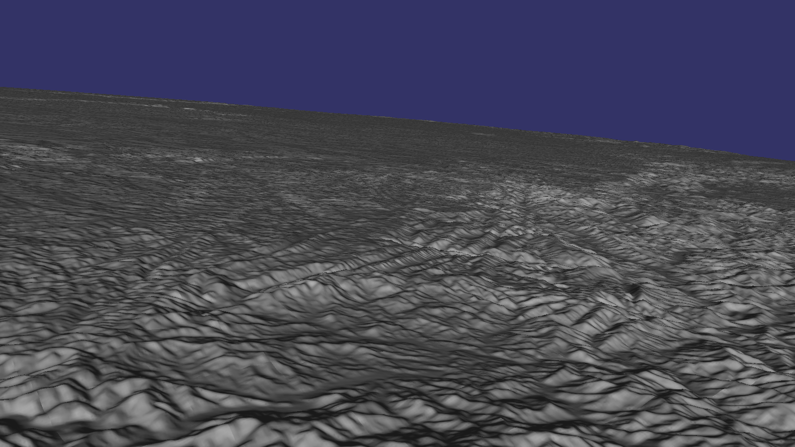
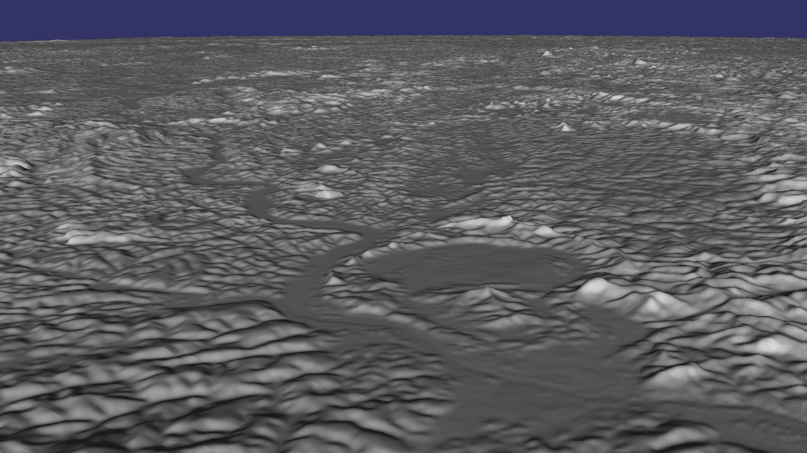
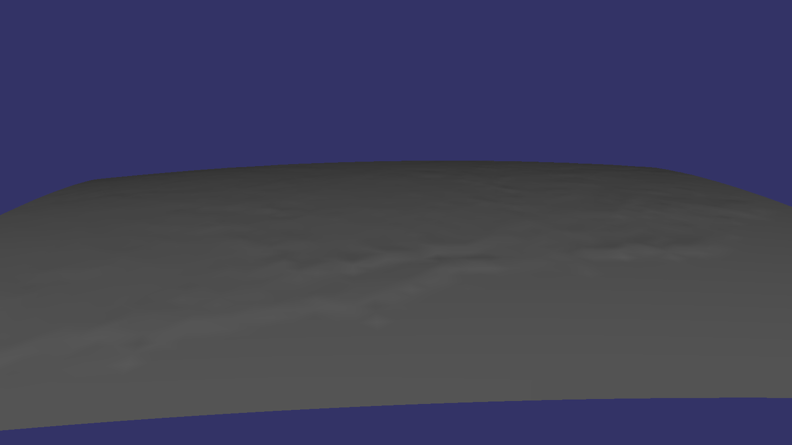
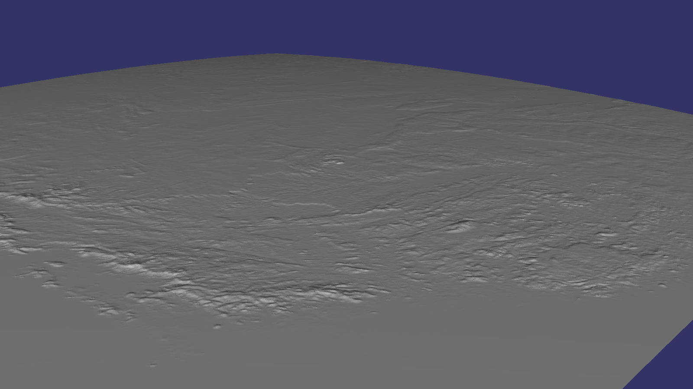

# Instalando e usando o OpenSceneGraph (OSG)

http://www.openscenegraph.org/

Salvar e descompactar o repositório (eu coloquei em ~/Downloads).

https://github.com/openscenegraph/OpenSceneGraph/tree/OpenSceneGraph-3.6.5

Ou baixe usando git-clone

```
(link http://www.openscenegraph.org/index.php/download-section/stable-releases/237-openscenegraph-3.6.5-released)
$ git clone --branch OpenSceneGraph-3.6.5 https://github.com/openscenegraph/OpenSceneGraph.git
```

## Debian 10

Para ver a versão da placa de vídeo e outras informações. Os dados abaixo são do meu PC.
```
# apt install mesa-utils
$ glxinfo

OpenGL vendor string: NVIDIA Corporation
OpenGL renderer string: GeForce GTX 750 Ti/PCIe/SSE2
OpenGL core profile version string: 4.6.0 NVIDIA 418.74
OpenGL core profile shading language version string: 4.60 NVIDIA

$ glxinfo  | grep rendering
direct rendering: Yes (usa aceleração 3D)

$ glxgears -info
300 frames in 5.0 seconds = 59.883 FPS
```

O que eu precisei instalar.
```
# apt install cmake libgl1-mesa-dev
(Pode também ser preciso libglu1-mesa-dev, freeglut3-dev)

$ cd ~/Downloads/OpenSceneGraph-OpenSceneGraph-3.6.5
$ cmake .
$ make
# make install

A documentação fala de # make install_ld_conf, mas comigo não funcionou. Ao invés disso, precisei

# vim /etc/ld.so.conf.d/openscenegraph.conf
Inserir a linha
${CMAKE_INSTALL_PREFIX}lib${LIB_POSTFIX}
# ldconfig
```

Baixar os dados de exemplo.

```
http://www.openscenegraph.org/index.php/download-section/31-data
Baixei do link OpenSceneGraph-Data-3.4.0.zip
(http://www.openscenegraph.org/downloads/stable_releases/OpenSceneGraph-3.4.0/data/OpenSceneGraph-Data-3.4.0.zip)

$ cd ~/Downloads/OpenSceneGraph-Data/
$ osgviewer cow.osg
Já dá pra ver a vaca metálica flutuando, podendo ser manipulada:
 - botão esquerdo e arrastar: girar o modelo
 - botão direito e arrastar (ou rodinha do mouse): zoom
 - botão do meio (rodinha) e arrastar: mover o modelo
 - barra de espaço no teclado: voltar à posição inicial
```

Compilando osgTerrain

`$ cd ~/Downloads/OpenSceneGraph-OpenSceneGraph-3.6.5/examples/osgterrain`

Caso tenha baixado por git-clone

`$ cd ~/Downloads/OpenSceneGraph/examples/osgterrain`

```
$ g++ osgterrain.cpp -lOpenThreads -losg -losgDB -losgViewer -losgGA -losgTerrain -losgFX -o osgterrain
$ ./osgterrain 
Warning: no valid data loaded, please specify a database on the command line.
```

Agora é achar que tipo de dados ele pede.

Ainda não encontrei documentação pra classe osgTerrain, que já vem com o osg. Mas encontrei outros links:

- https://groups.google.com/forum/#!forum/osg-users
- http://www.openscenegraph.org/index.php/documentation/user-guides/57-osgdem
- https://www.osgvisual.org/wiki/OsgTerrainData
- http://docs.osgearth.org/en/latest/data.html
- https://github.com/openscenegraph/VirtualPlanetBuilder
- http://www.openscenegraph.org/index.php/documentation/tools/virtual-planet-builder
- http://www.andesengineering.com/BlueMarbleViewer/

E ainda os livros:

- Rui Wang & Xuelei Qian, 2010. OpenSceneGraph 3.0 Beginner's Guide: Create high-performance virtual reality applications with OpenSceneGraph, one of the best 3D graphics engines.
- Paul Martz, 2007. OpenSceneGraph Quick Start Guide: A Quick Introduction to the Cross-Platform Open Source Scene Graph API.
- Rui Wang & Xuelei Qian, 2012. OpenSceneGraph 3 Cookbook: Over 80 recipes to show advanced 3D programming techniques with the OpenSceneGraph API.

Os três livros podem ser encontrados na Library Genesis (http://libgen.is/).

---

#### Visualizando arquivos de relevo.

Encontrei [essa thread](https://groups.google.com/forum/#!searchin/osg-users/osgterrain$20data$20format|sort:date/osg-users/UoYOwKja4L8/n7OIZH3WCgAJ) que me deu a ideia de colocar .gdal no nome do arquivo.

Para instalar o GDAL

`sudo apt-get install libgdal-dev`

Para visualizar a imagem

`osgviewer --dem BRalt.tif.gdal`

gerou uma visualização 3D desta imagem:



que ficou mais ou menos assim:



Detalhe: não precisei renomear o arquivo de BRalt.tif pra BRalt.tif.gdal.

Ainda não é o que precisamos, mas já é um passo na direção certa. Os próximos passos são:

- Ajustar a posição e movimento da câmera;
- Colocar o relevo na escala desejada;
- Acrescentar a textura (br.png);
- Fazer tudo isso (principalmente) via C++, e não (somente) pelo osgviewer.


---

#### Tentando com o [VirtualPlanetBuilder](https://github.com/openscenegraph/VirtualPlanetBuilder):

Baixei em ~/Downloads e descompactei. Depois:

```
$ cd ~/Downloads/VirtualPlanetBuilder-master
$ ./configure
$ cmake .
$ make
# make install
$ ls bin
osgdem  vpbcache  vpbmaster  vpbsizes
```

Não sei se o `cmake .` é realmente necessário. O executável mais importante foi criado, vpbmaster, que será usado no capítulo 7 do Cookbook.

#### Usando o vpbmaster para criar os arquivos de terreno


`vpbmaster` estava dando o seguinte erro:

`vpbmaster: error while loading shared libraries: libvpb.so.30: cannot open shared object file: No such file or directory`

Precisei criar a variável de ambiente `LD_LIBRARY_PATH` apontando para o diretório do `libvpb.so.30`. Acrescentei ao .bashrc:

`export LD_LIBRARY_PATH=/usr/local/lib:/usr/local/lib64/`

Com isso, o comando

`vpbmaster -d BRalt.tif -t br.png -o BR.osgb`

criou 65 MB de arquivos em 17 pastas (BR_root_L0_X0_Y0 até BR_subtile_L3_X3_Y3), mais 86 kB em 5 arquivos (BR.osgb e família). Agora sim:

`osgviewer BR.osgb`

mostra um terreno com textura, mas aparentemente plano:



Olhando mais de perto, vemos onde o relevo foi parar:




Faltavam os arquivos .wld (world files) para o relevo e a textura:

```
br.wld:
0.008925319
0
0
-0.008925319
-74.0
5.333333333

BRalt.wld:
0.066666667
0
0
-0.066666667
-74.0
5.333333333
```

Cada arquivo .wld é um arquivo-texto com seis linhas, cada uma com um valor decimal:

- Linha 1: tamanho do pixel no eixo X.
- Linha 2: rotação sobre X (geralmente 0).
- Linha 3: rotação sobre Y (geralmente 0).
- Linha 4: tamanho do pixel no eixo Y. Costuma ser negativo porque imagens são armazenadas de cima para baixo.
- Linha 5: longitude (X) central do pixel superior-esquerdo (-74 aqui).
- Linha 6: latitude (Y) central do pixel superior-esquerdo (5.333333 aqui).

Faltava ainda regular o multiplicador vertical, feito com o parâmetro -v do `vpbmaster`.

`vpbmaster -v 0.01 -d BRalt.tif -t br.png -o outBR6/BR6.osgb`

`osgviewer outBR6/BR6.osgb`





Na última imagem aparecem as "costuras" onde se encontram as camadas criadas pelo vpbmaster. Falta descobrir como resolver isso.

Agora é possível carregar o terreno via C++, modificando um pouco o código do exercício [Cookbook 2.3](https://github.com/eco-info/osgCookbook2.3)

```
#include <osgDB/ReadFile>
#include <osgViewer/Viewer>

int main( int argc, char** argv )
{
	osg::ref_ptr<osg::Group> root = new osg::Group;
	root->addChild( osgDB::readNodeFile("BR6.osgb") );
	osgViewer::Viewer viewer;
	viewer.setSceneData( root.get() );
	return viewer.run();
}
```
Este código pode ser compilado assim:

`g++ terrain1.cpp -losg -losgDB -losgViewer -o terrain1`

Agora falta descobrir como manipular a câmera usando as teclas ASDW (ou setas) e outras teclas auxiliares, como QERF, PageUp, PageDown...

#### Juntando vários rasters

Primeiro baixei vários arquivos contíguos de relevo do projeto [SRTM](http://srtm.csi.cgiar.org/srtmdata/), do CGIAR (Consortium for Spatial Information), salvando todos na mesma pasta (SRTM).

A textura global (earthmap_hires.jpg) baixei [daqui](http://flatplanet.sourceforge.net/maps/images/earthmap_hires.jpg).

Depois o comando para processá-los:

`vpbmaster -d SRTM -t earthmap_hires.jpg --geocentric -o output/out.osgb`

Parece que a textura também deve estar georreferenciada, pois não apareceu no resultado (`osgviewer out.osgb`).





Embora o relevo tenha apresentado alta resolução de perto, os arquivos gerados ocuparam 914 MB. No produto final, será usada apenas uma fração dessa qualidade, tanto pela redução da resolução dos arquivos de relevo, quanto com um número menor de camadas intermediárias (o padrão aqui foi 8). Gerando, por exemplo, 3 camadas intermediárias:

`vpbmaster -l 3 -d SRTM -t earthmap_hires.jpg --geocentric -o output3/out.osgb`

os arquivos gerados ocuparam apenas 22.9 kB, mas o resultado ficou bastante rudimentar:



Gerando 6 camadas intermediárias:

`vpbmaster -l 6 -d SRTM -t earthmap_hires.jpg --geocentric -o output6/out.osgb`

os arquivos gerados ocuparam 5.4 MB, e o resultado ficou bem mais satisfatório.



Lembrando que as imagens acima representam 4 grids do SRTM, ou seja, uma região de 10x10 graus: 15 a 25° sul, 40 a 50° oeste.
